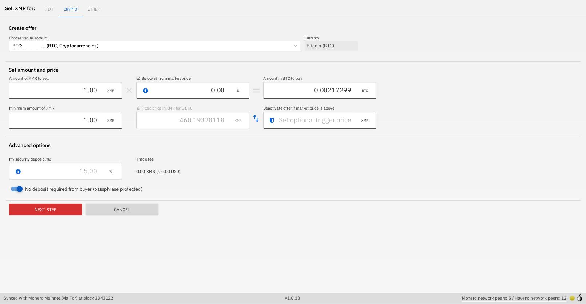
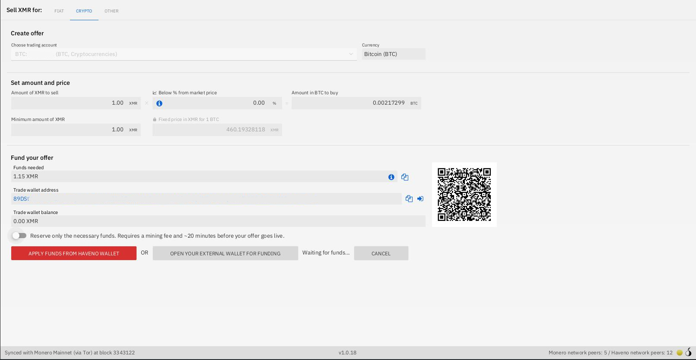
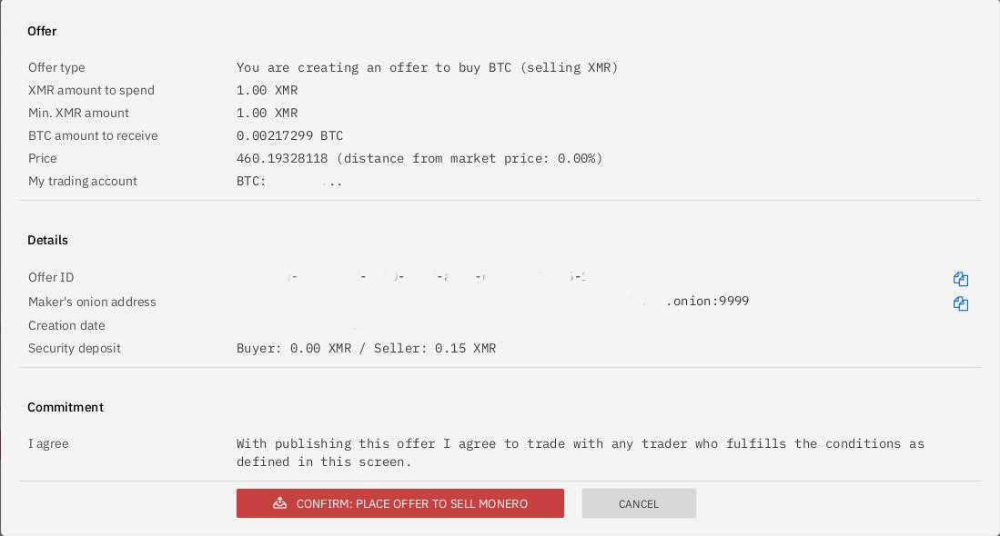
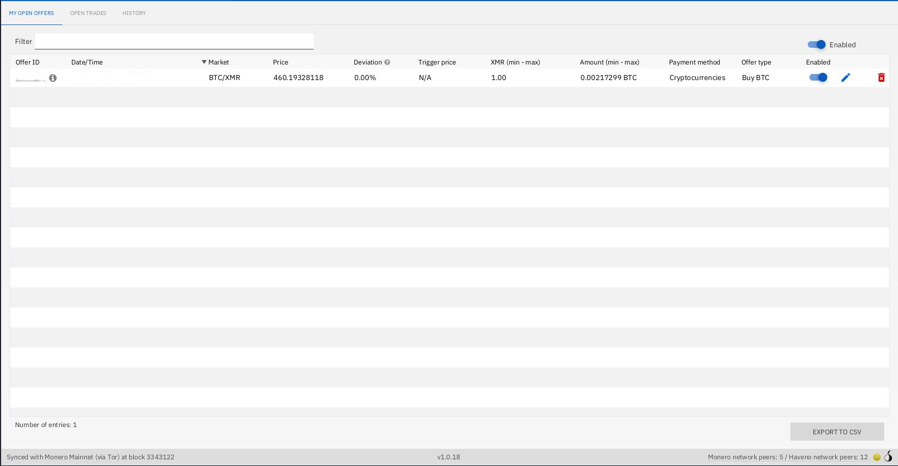
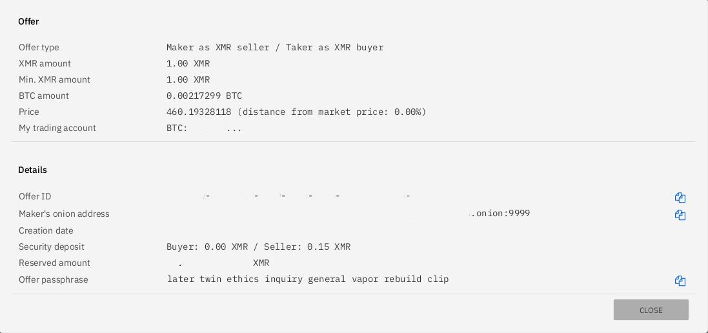
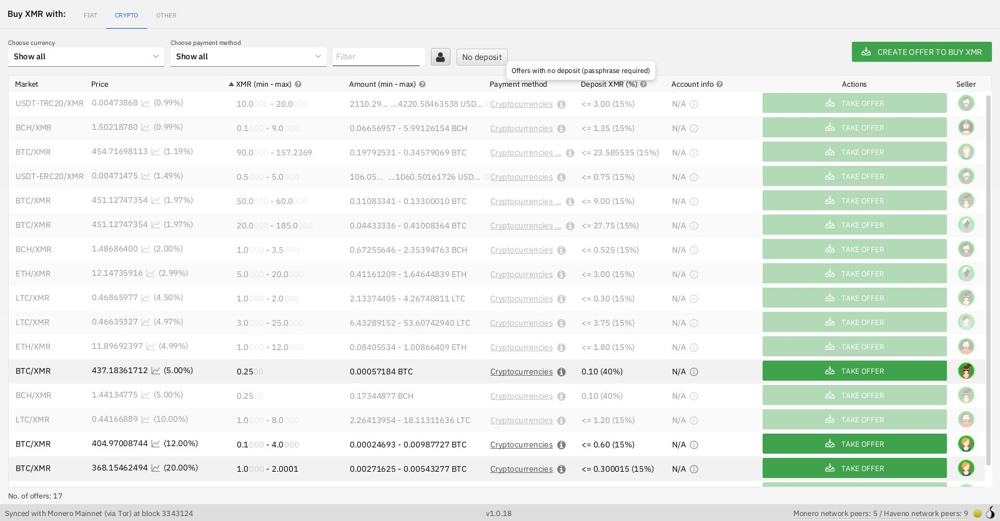
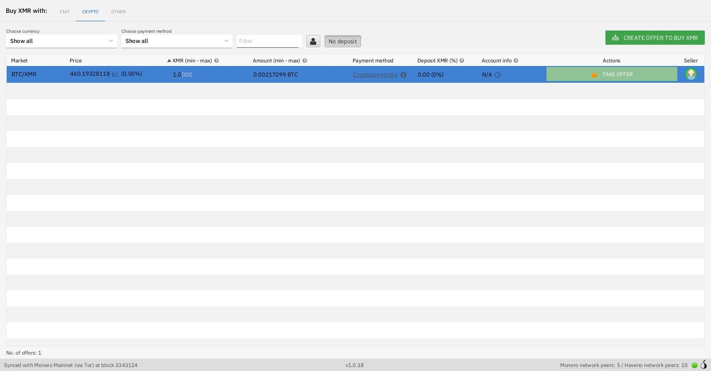
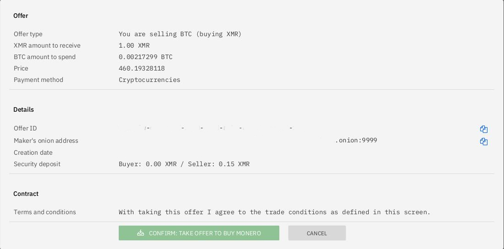
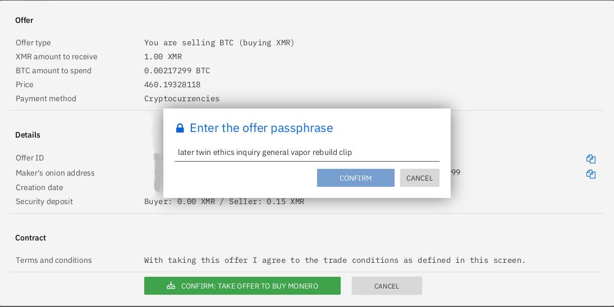

# No-deposit offers

For newbies who want to buy their first XMR and do not yet have XMR for security deposit, Haveno allows selling `no-deposit` offers limited up to 1.5 XMR.

!!! info
    Those offers are passphrase protected for avoiding regular risks of no-deposit trading (scams, walking away & more activities that can't be financially penalized without a deposit). So a seller must take care when offering this solution.

### 1. Publishing a no-deposit offer

- Create a new offer to sell XMR and make sure to turn-on `No deposit required from buyer (passphrase protected)`

!!! info
    [Since Haveno v1.0.19](https://github.com/haveno-dex/haveno/pull/1557), it supports additional info on **all** offers so that buyers can be given a contact option where they can request the passphrase. Optional additional information can also be changed in `MY OPEN OFFERS` using `Edit offer`

- Review and confirm offer publishing

- Go in `Portfolio` > `MY OPEN OFFERS`, click on details of your Offer ID to get your offer passphrase for sharing it to your buyer

### 2. Taking a no-deposit offer

- Click on `No-deposit` & click on the offer you want to take.

- Confirm taking an offer & enter the offer passphrase you got from the seller.

Once passphrase got submitted, you can follow the regular trading.
