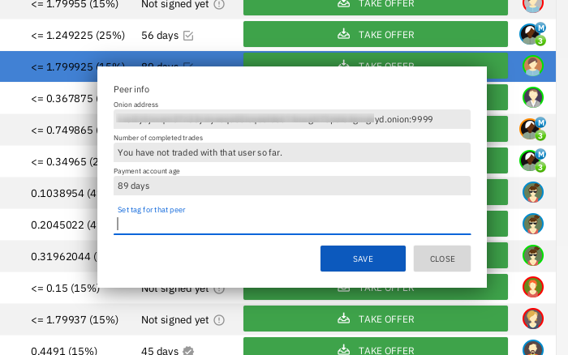
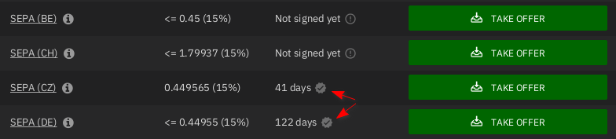

# Account limits

Elevated account limits apply to fiat payment accounts in order to limit damage a malicious user can do while allowing honest users to start trading immediately with no KYC and utmost privacy.

Cryptocurrency accounts can trade 528 XMR right away, but all fiat payment account types have lower limits to match their particular risk profiles (see [this table](payment_methods/0-all-methods.md/#1-fiat-payment-methods) for details). Some payment methods with chargeback risk implement a mechanism called **account signing** that restricts trading activity until a trader proves their integrity to further secure against foul play.

## Which payment accounts are affected

Only fiat payment methods are affected by elevated account limits in Haveno.

All fiat payment methods in all markets limit total trade size depending on the payment method's risk profile (see [this table](payment_methods/0-all-methods.md/#1-fiat-payment-methods) for details).

Despite these limitations, chargebacks can still be possible for certain payment methods. Haveno reduces this risk with a mechanism called **account signing**.

Account signing only applies to payment accounts that are subject to chargeback risk: SEPA, SEPA Instant, Interac e-Transfer, Zelle, Revolut, Chase QuickPay, Popmoney, MoneyBeam, Uphold, and any kind of bank transfer.

## Account aging

Account age is not used to determine trade size limits for payment methods. However, it is measured, and you can see a payment account's age in the offer book before taking an offer, but we caution against using it as a measure of integrity. Older accounts are not **necessarily** safer.

/// caption
See account age in the offer book.
///

**All payment methods on Haveno have full selling capability from the moment they are created.**

Some payment methods implement a variation of account aging called account signing whereby limits are increased in stages over a period of 60 days after signing. More about this below.

If you're interested, details on the `AccountAgeWitness` object that enables this aging mechanism are [here](https://github.com/haveno-dex/haveno/blob/master/core/src/main/java/haveno/core/account/witness/AccountAgeWitnessService.java).

## Account signing

Account signing limits **buying** limits of risky fiat payment methods to 3 XMR until the trader has bought Monero from a seller with a signed payment account, and then gradually phases in full buying limits. Selling limits are unaffected.

In a nutshell, this is how it works:

- Payment account is created in Haveno for risky payment method
    - Buying is limited to 3 XMR per trade until account is signed (see how [below](#how-to-get-an-account-signed))
- 30 days after signing, buying limits are increased to 50% of maximum
- 60 days after signing, maximum trade size is allowed

Let's see how this works in practice by looking at an example. SEPA has a maximum trade size of 12 XMR, and it requires account signing in order for to enable full trade limits.

First let's observe what happens if a new SEPA account is never signed. Notice how buying limits never increase beyond 3 XMR, but selling 12 XMR is allowed from day 0.

| Time Since Creating SEPA Payment Account  (Never Signed) | Maximum Trade Size (Buy) | Maximum Trade Size (Sell) |
| ---------------------------------------- | ------------------------ | ------------------------- |
| Day 0 | 3 XMR | 12 XMR |
| Day 30 | 3 XMR | 12 XMR |
| Day 60 | 3 XMR | 12 XMR |
| > 60 | 3 XMR | 12 XMR |

If that SEPA account manages to get signed on the same day it's created, it will see its 3 XMR limit increased on Day 30. Selling limits are unaffected.

| Time Since Creating SEPA Payment Account | Maximum Trade Size (Buy) | Maximum Trade Size (Sell) |
| ---------------------------------------- | ------------------------ | ------------------------- |
| Day 0 - Account Signed | 3 XMR | 12 XMR |
| Day 30 | 6 XMR | 12 XMR |
| Day 60 | 12 XMR | 12 XMR |
| > 60 | 12 XMR | 12 XMR |

But if that SEPA account isn't signed until Day 30, it won't see its limits lifted until Day 60. Again, selling limits are unaffected.

| Time Since Creating SEPA Payment Account | Maximum Trade Size (Buy) | Maximum Trade Size (Sell) |
| ---------------------------------------- | ------------------------ | ------------------------- |
| Day 0 | 3 XMR | 12 XMR |
| Day 30 - Account Signed | 3 XMR | 12 XMR |
| Day 60 | 12 XMR | 12 XMR |
| > 60 | 12 XMR | 12 XMR |

## How to get an account signed

Payment accounts that require signing cannot buy more than 3 XMR until 30 days **after** they are signed. There's two ways to get your account signed.

### 1. Buying XMR

To sign your account you have to buy XMR following these requirements:

- trade amount is greater than or equal to 0.1 XMR and lesser than or equal to 3 XMR
- seller's account must have been signed for over 30 days at the time of the signing trade

Through taking an offer you can make sure that the offer fulfils the requirements to sign your account. Making an offer could not sign your account, because taker could be unable to sign your account (signed since less than 30 days, or unsigned).

The Haveno interface makes it easy to determine if an offer can help you get signed: simply **look for buy offers with a check mark badge**:

/// caption
Top offers won't get you signed. Bottom offers will get you signed.
///

In the image above, the offers on top do not have a check mark, but the offers on the bottom do. And it's a valid size (i.e. between 0.1 XMR and 3 XMR), so taking that offer and successfully completing the trade will result in a signed account.

You can see your payment account's limits and signing status at  
`Accounts` > `Traditional Currency Accounts` Pick an account and look toward the bottom:

### 2. With your own signed account

Once you have 1 signed payment account, any **new** payment account you create that requires signing will be self-signed as long as it uses the **exact same name** as your previously signed account. The payment account can be of a different type (e.g. a signed SEPA account can self-sign a SEPA Instant account), but a payment account created with a name that is even slightly different will not be self-signed.

Payment account types that don't require your full name cannot be self-signed (e.g. Revolut, which only requires an email address) and they cannot self-sign other payment accounts.

Self-signed accounts are immediately signed, but limits are not immediately lifted. This is because they have an age of 0 days, so 30 days must pass for the 3 XMR limit to be lifted, and another 30 days must pass for full trading ability to take effect (see tables above).

## Backing up and restoring payment accounts

Once your payment accounts have accrued age and been signed, you won't want to give them up. With [proper backups](../haveno-ui/backup_and_restore.md), you won't have to—payment accounts can be restored if you ever have to remove/reinstall Haveno, move to another machine, etc.
