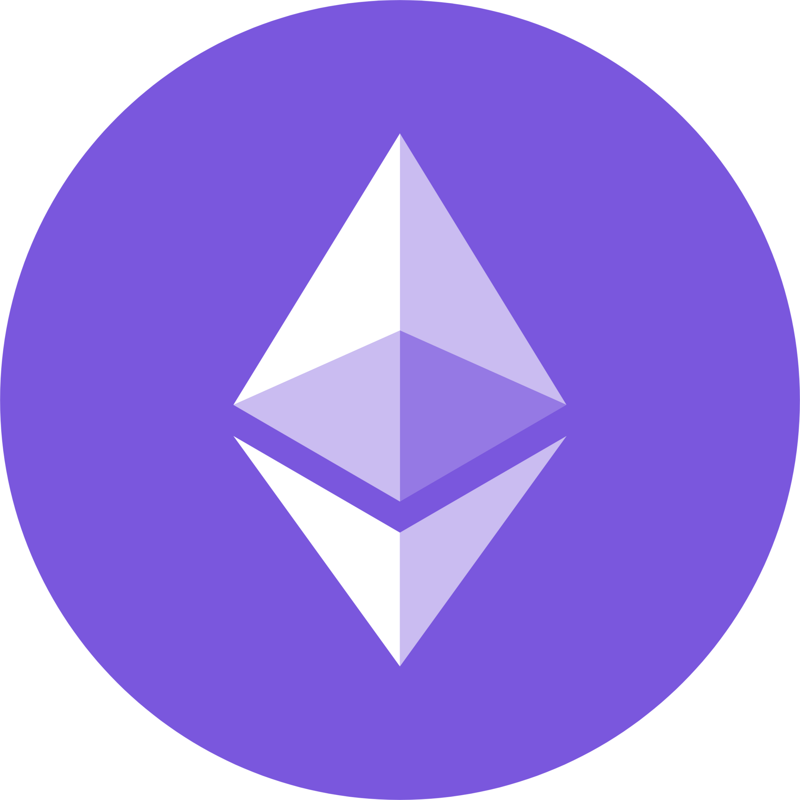
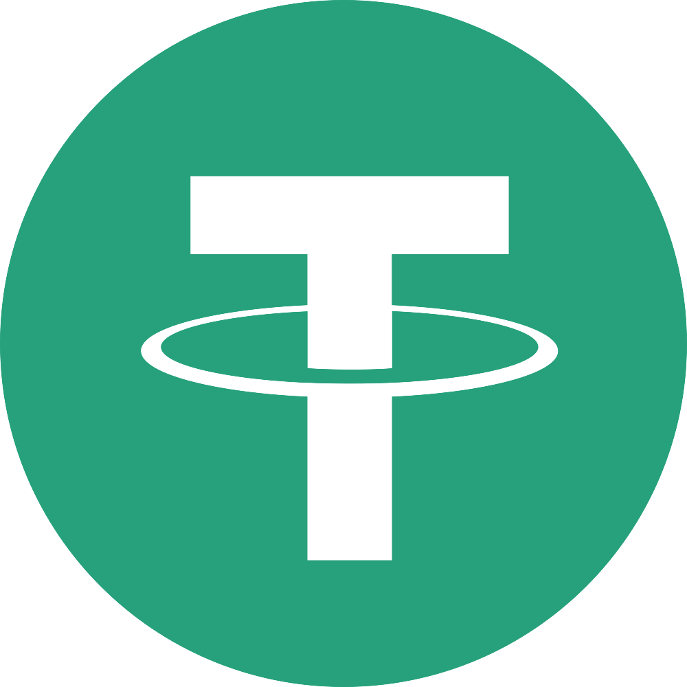
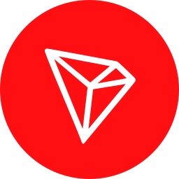
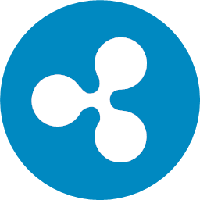
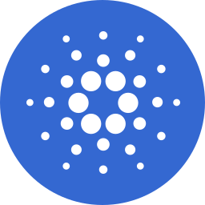

# Assets

These are the assets currently supported on Haveno. The community is welcome to suggest new assets by [opening a request](https://github.com/haveno-dex/listing).

## Crypto

These are the cryptocurrencies currently listed on Haveno:

!!! info "Remember"
    Monero is the base currency of all the cryptocurrencies below (e.g. XMR/BTC, XMR/ETH).

<!-- Crypto Logos Archive: https://cryptologos.cc/ -->

{ .crypto-logos } [Monero](https://getmonero.org)

{ .crypto-logos } [Bitcoin](https://bitcoin.org)

{ .crypto-logos } [Bitcoin Cash](https://bitcoincash.org)

{ .crypto-logos } [Ether](https://ethereum.org)

{ .crypto-logos } [Litecoin](https://litecoin.org)

{ .crypto-logos } [Tether USDT](https://tether.to)

{ .crypto-logos } [USD Coin](https://www.circle.com/usdc)

{ .crypto-logos } [DAI Stablecoin](https://makerdao.com/en/)

{ .crypto-logos } [Tron](https://tron.network/)

{ .crypto-logos } [Solana](https://solana.com/)

{ .crypto-logos } [Ripple](https://ripple.com/)

{ .crypto-logos } [Dogecoin](https://dogecoin.com/)

{ .crypto-logos } [Cardano](https://cardano.org/)

## Payment Methods and fiat currencies

!!! info
    [Overview](payment_methods/0-all-methods.md) of payment methods and supported fiat currencies.
